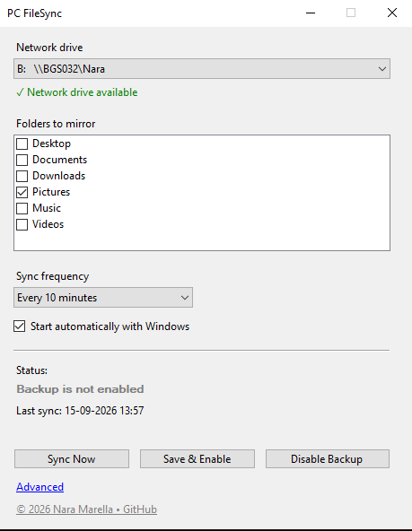
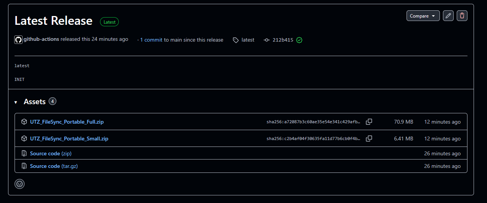

# PC FileSync

**PC FileSync** is a simple helper program for Windows. It automatically copies your personal computer folders (like **Documents**, **Pictures**, or **Desktop**) to your network backup drive so your files stay safely backed up.

---

### ⚠️ Important: How This FileSync Works

This program creates an **exact mirror copy** of your folders onto your Network drive.

1. **Files moves one way (not bidirectional):** Changes on your C:// drive copy over to the Network drive and from Network Drive to MUW Backup Server. example Network drive is **B://BGS032/Nara**, your Network Drive letter will not be *B", it will be different.
 **File Sync and Backup Frequency :** You set up **File Sync** frequency between your C Drive and Network Drive using **PC FileSync** settings. **Backup** frequency between NetworkDrive and MUW Server is scheduled **ONLY** in the night.
2. **Can files be lost permanently ?:** Yes, if you created a file and deleted a file in less than 24 hours, then that file will not be backed up in MUW Server and will be lost permanently. **OR** if the file is deleted today and you want to retrieve after 6 months, then also file will be lost permanently.
3. **What happens if I delete a file in C Drive:** File will also be deleted from Network drive but the file **may** be present in MUW Backup Server (see point 2 above).
4. **What is MUW Backup Server ?**: MUW IT uses [TSM Backup Server](https://intranet.meduniwien.ac.at/allgemeines/it-services/service-allgemein/tsm-backup/#c1948). Files in Network drive are saved in MUW Backup Server for 6 months. After that they are deleted. 
5. **How to retrieve files from MUW Backup Server:** Contact IT Services, email address is available in [MUW Intranet](https://intranet.meduniwien.ac.at/allgemeines/it-services/infrastruktur/backupsysteme/#c3597).

---

## Step 1: Download the Program

1. Look at the top right side of this GitHub page and click on **Releases** (or look for the **Latest Release** box).

2. Under the **Assets** list at the bottom, click on **`UTZ_FileSync_Portable_Full.zip`** to download it.

> **Which one should I choose?**
> * **`UTZ_FileSync_Portable_Full.zip`** *(Recommended)* — Works right away on any Windows computer without needing any extra software installed.
> * **`UTZ_FileSync_Portable_Small.zip`** — A smaller file, but requires Microsoft .NET 8 to already be installed on your computer.

---

## Step 2: Open the Program

1. Open your computer's **Downloads** folder.
2. Right-click the downloaded **`UTZ_FileSync_Portable_Full.zip`** folder and select **Extract All...**, then click **Extract**.
3. Open the newly created folder and double-click the **`UTZ_FileSync.exe`** file to start the program.

*(No installation or administrator passwords are needed!)*

---

## Step 3: Setting Up Your Backup

When the program window opens, follow these simple steps:

1. **Network drive:** Click the dropdown box at the top and select your backup drive (for example, `B:\`).
* Look for the green checkmark: **`✓ Network drive available`**.

2. **Folders to mirror:** Click the checkboxes next to the folders you want to save (e.g., check **Documents** and **Pictures**).
3. **Sync frequency:** Choose how often you want the program to check for new files (e.g., *Every 10 minutes* or *Every 1 hour*).
4. **Start automatically with Windows:** Keep this box checked so your backup works quietly in the background every time you turn on your computer.
5. **Click "Save & Enable":**
* The program will guide you through a quick review screen to confirm your choices.
* Click **OK** to finish setting it up.

---

## What the Buttons Do

* **Sync Now:** Backs up your files immediately instead of waiting for the automatic timer.
* **Save & Enable:** Saves your settings and turns on the automatic background backup.
* **Disable Backup:** Temporarily stops automatic backups. *(This will never delete any files already saved on your backup drive).*
* **Advanced:** Shows detailed technical information and logs if you ever need help from computer support.

---

## Technical Information for Developers

If you are a programmer or IT administrator looking for source code, build instructions, safety safeguards, or technical specifications, please see **[TECH.md]()**.
